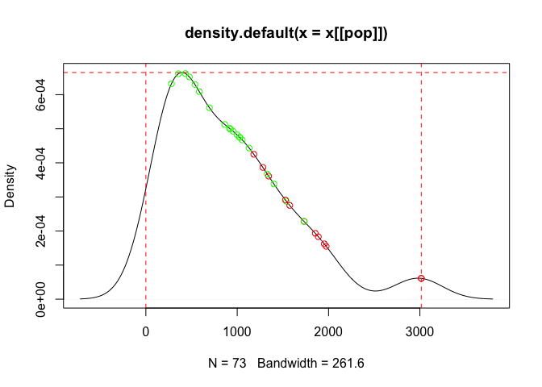

<!-- README.md is generated from README.Rmd. Please edit that file -->

# surveysampler: Survey Sampling and Analysis Tools

<!-- badges: start -->

[](https://www.repostatus.org/#wip)
[](https://lifecycle.r-lib.org/articles/stages.html#experimental)
[](https://github.com/ernestguevarra/surveysampler/actions)
[](https://www.codefactor.io/repository/github/ernestguevarra/surveysampler)
<!-- badges: end -->

Studies that evaluate survey sampling and analysis approaches require
varied techniques and methods not found in a single package in R. This
package provides utilities that aid and simplify these approaches to
enable streamlined assessment and comparison of different survey
sampling and analysis techniques.

This package has been developed in support of a [Medecins Sans
Frontieres UK](https://msf.org.uk) study on the impact of probability
proportional to population size (PPS) sampling on health and nutrition
surveys particularly in contexts of humanitarian emergencies.

## Installation

`surveysampler` is not yet available from
[CRAN](https://CRAN.R-project.org) but the development version is
available from [GitHub](https://github.com/) and can be installed with:

``` r
if (!require(remotes)) install.packages("remotes")
remotes::install_github("ernestguevarra/surveysampler")
```

## Usage

### Recreate an unweighted survey sample from a probability proportional to population size (PPS)-drawn dataset

Given a dataset from a typical health and nutrition survey with a sample
that has been drawn using probability proportional to population size
(PPS) and a dataset consisting of all the potential sampling units with
their population sizes from which the survey sample was taken, we
develop two approaches to recreate an unweighted survey sample. Such
approaches allow for the use of readily available PPS-drawn datasets in
studies that aim to test the impact of PPS samples on health and
nutrition indicators measurement.

#### Acceptance-rejection algorithm

Using the probability density of the populations of all the potential
sampling units from which a specific survey sample was drawn from, we
accept or reject a sampling unit from the survey sample if it matches
the probability density of the populations of potential sampling units.
The idea here is that we pick sampling units that we might get from a
random or systematic sample of potential sampling units.

We developed the function `accept_reject_sample()` for this purpose. The
function requires two datasets:

1.  a full list of potential sampling units with their populations such
    as the one below

``` r
village_list
#> # A tibble: 73 x 4
#>       id village        population cluster
#>    <dbl> <chr>               <dbl> <chr>  
#>  1     1 BODO FOUDA          1733. 1      
#>  2     2 BODO GOUALGA        1975. 3      
#>  3     3 BODO GUEFTAGUE      1889. 4      
#>  4     4 DJIMTILO             310. <NA>   
#>  5     5 BLOUMTAGUE           299. <NA>   
#>  6     6 NANAMI               433. 5      
#>  7     7 LAFIA 1              847. <NA>   
#>  8     8 LAFIA 2              211. <NA>   
#>  9     9 LAFIA CKRENACK       117. <NA>   
#> 10    10 MESSIO               916. 6      
#> # … with 63 more rows
```

2.  a survey dataset drawn via PPS from the full list of potential
    sampling units such as the one below

``` r
sample_data
#> # A tibble: 407 x 11
#>    surveydate   psu   sex birthdate    age weight height oedema  muac measure
#>    <date>     <int> <int> <date>     <int>  <dbl>  <dbl>  <int> <int> <chr>  
#>  1 2020-12-16    18     2 NA             6    6.9   65        0   144 l      
#>  2 2020-12-16    16     1 2020-05-22     6    7.8   65.6      0   140 l      
#>  3 2020-12-19    13     2 2020-05-26     6    5.2   62.6      0   131 l      
#>  4 2020-12-19     3     2 2020-06-19     6    7     69.1      0   133 l      
#>  5 2020-12-19    15     2 2020-06-13     6    5.4   62.4      0   127 l      
#>  6 2020-12-20    14     1 NA             6    7.1   66.3      0   152 l      
#>  7 2020-12-20     9     1 2020-05-23     6    7.1   65.5      0   123 l      
#>  8 2020-12-23    30     2 NA             6    8.5   63.2      0   168 l      
#>  9 2020-12-23    24     1 2020-06-04     6    8.5   68.6      0   161 l      
#> 10 2020-12-18     4     2 2020-05-03     7    7.5   68.2      0   148 l      
#> # … with 397 more rows, and 1 more variable: clothes <chr>
```

The function can be used as follows:

``` r
accept_reject_psu(
  x = village_list,
  svy = sample_data,
  psu = c("id", "psu"),
  match = "cluster",
  pop = "population",
  verbose = FALSE,
  show_plot = TRUE
)
```

and returns a plot of the accepted and rejected samples against the
probability density of the populations, and the simulated unweighted
survey sample like below:



    #> # A tibble: 412 x 11
    #>    surveydate   psu   sex birthdate    age weight height oedema  muac measure
    #>    <date>     <dbl> <int> <date>     <int>  <dbl>  <dbl>  <int> <int> <chr>  
    #>  1 2020-12-19     1     2 NA             8    8.8   66.1      0   163 l      
    #>  2 2020-12-19     1     1 2020-03-20     9    8.6   72.4      0   149 l      
    #>  3 2020-12-19     1     2 2019-04-16    20   10.1   79.6      0   142 l      
    #>  4 2020-12-19     1     2 2018-12-05    24    9     79.2      0   136 h      
    #>  5 2020-12-19     1     1 2018-11-12    25   13.3   86.8      0   157 h      
    #>  6 2020-12-19     1     2 NA            28    9.2   85.9      0   118 h      
    #>  7 2020-12-19     1     1 2018-01-16    35   15.1   95.6      0   147 h      
    #>  8 2020-12-19     1     2 2017-12-02    36   12.6   94.5      0   148 h      
    #>  9 2020-12-19     1     1 2017-08-17    40   13.2   86.1      0   166 h      
    #> 10 2020-12-19     1     1 2017-02-09    46   13.9   91.3      0   170 h      
    #> # … with 402 more rows, and 1 more variable: clothes <chr>

#### Propensity score matching

Using a dataset of all potential sampling units and their population
sizes from which a specific survey sample was drawn from, we draw a
simple random sample or a systematic sample and then match with the
survey sample based on propensity scores of their population sizes. The
simulated survey sample is then created from sampling units from the
survey sample that have been directly selected or that match the
potential sampling units that are not in the survey sample.

We developed the function `create_sample_psm()` for this purpose which
can be used as follows:

``` r
create_sample_psm(
  x = village_list,
  svy = sample_data,
  psu = c("id", "psu"),
  match = "cluster", 
  pop = "population"
)
```

and returns a simulated unweighted survey sample like below:

    #> # A tibble: 278 x 11
    #>    surveydate   psu   sex birthdate    age weight height oedema  muac measure
    #>    <date>     <int> <int> <date>     <int>  <dbl>  <dbl>  <int> <int> <chr>  
    #>  1 2020-12-16    18     2 NA             6    6.9   65        0   144 l      
    #>  2 2020-12-16    16     1 2020-05-22     6    7.8   65.6      0   140 l      
    #>  3 2020-12-19    13     2 2020-05-26     6    5.2   62.6      0   131 l      
    #>  4 2020-12-19    15     2 2020-06-13     6    5.4   62.4      0   127 l      
    #>  5 2020-12-20     9     1 2020-05-23     6    7.1   65.5      0   123 l      
    #>  6 2020-12-23    30     2 NA             6    8.5   63.2      0   168 l      
    #>  7 2020-12-23    24     1 2020-06-04     6    8.5   68.6      0   161 l      
    #>  8 2020-12-18    10     1 NA             7    6.9   69        0   119 l      
    #>  9 2020-12-22    32     1 NA             7    7.7   64.7      0   156 l      
    #> 10 2020-12-23    24     2 2020-05-17     7    6.5   63.2      0   140 l      
    #> # … with 268 more rows, and 1 more variable: clothes <chr>

## Citation

If you find the `surveysampler` package useful please cite using the
suggested citation provided by a call to the `citation` function as
follows:

``` r
citation("surveysampler")
#> Warning in citation("surveysampler"): no date field in DESCRIPTION file of
#> package 'surveysampler'
#> 
#> To cite package 'surveysampler' in publications use:
#> 
#>   Mark Myatt and Ernest Guevarra (2021). surveysampler: Survey Sampling
#>   and Analysis Tools. R package version 0.1.0.
#>   https://github.com/ernestguevarra/surveysampler
#> 
#> A BibTeX entry for LaTeX users is
#> 
#>   @Manual{,
#>     title = {surveysampler: Survey Sampling and Analysis Tools},
#>     author = {Mark Myatt and Ernest Guevarra},
#>     year = {2021},
#>     note = {R package version 0.1.0},
#>     url = {https://github.com/ernestguevarra/surveysampler},
#>   }
```

## License

The `surveysampler` package is distributed under the [GPL-3
license](https://ernest.guevarra.io/surveysampler/LICENSE.html).

## Community guidelines

Feedback, bug reports and feature requests are welcome; file issues or
seek support
[here](https://github.com/ernestguevarra/surveysampler/issues). If you
would like to contribute to the package, please see our [contributing
guidelines](https://ernest.guevarra.io/surveysampler/CONTRIBUTING.html).

Please note that the `surveysampler` project is released with a
[Contributor Code of
Conduct](https://ernest.guevarra.io/surveysampler/CODE_OF_CONDUCT.html).
By contributing to this project, you agree to abide by its terms.
